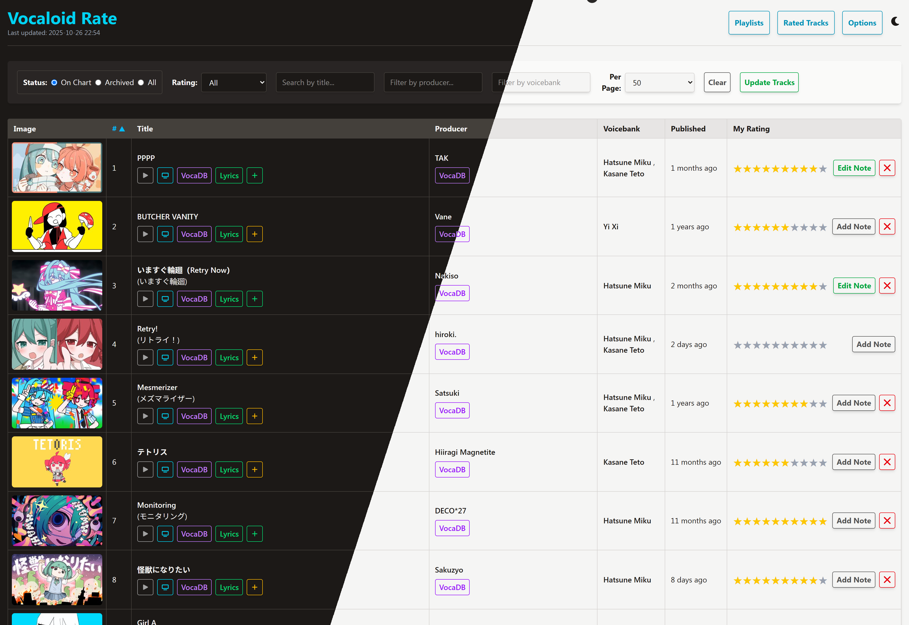
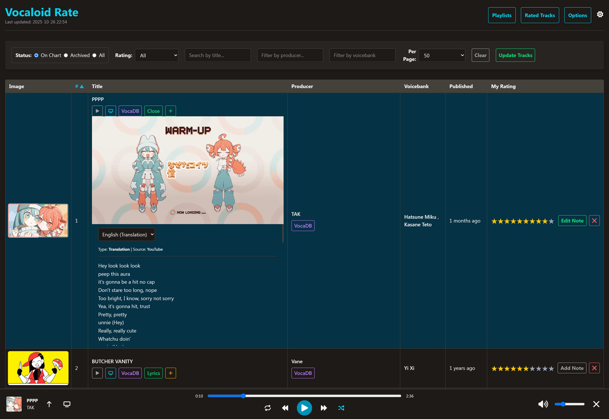
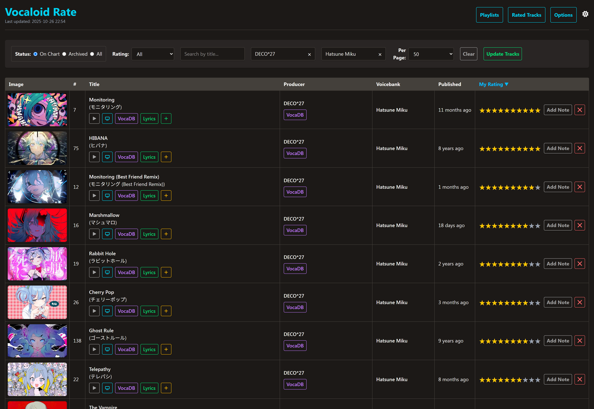

# Vocaloid Rate



Vocaloid Rate is a personal, self-hosted web application for tracking, rating, and exploring Vocaloid music rankings. It periodically scrapes data from [Vocaloard](https://vocaloard.injpok.tokyo/en/), providing a clean and feature-rich interface to manage a personal collection of rated tracks.

The application is built with a Python backend using FastAPI and a dynamic vanilla JavaScript frontend.


## Features

-   **Dynamic Track Table:** View the latest Top 300 Vocaloid tracks, with support for sorting by rank, title, producer, and more.
-   **Personal Ratings:** Rate songs on a 1-10 star scale. Your ratings are saved locally in a SQLite database.
-   **Interactive Filtering:**
    -   Filter by text search for Title (EN/JP), Producer, and Voicebank.
    -   Filter by rating status (Rated, Unrated, All).
    -   Filter by chart status (On Chart vs. Expired/Archived).
-   **Dedicated Rated Tracks Page:** A dashboard view of all your rated songs, featuring detailed statistics.
-   **Advanced Statistics:**
    -   View your average and median ratings.
    -   See your Top 10 favorite producers and voicebanks, calculated with a weighted Bayesian average.
    -   Interactive rating distribution chart to filter tracks by a specific score.
-   **Rich Media Integration:**
    -   Embed YouTube videos directly in the track list.
    -   Fetch and display song lyrics from the VocaDB API, with a language selector.
    -   Button to open the official song page on VocaDB.
-   **Smart Scraping:** The data update process is optimized to first check for changes in the rankings before running a full scrape, saving time and resources.
-   **Modern UI/UX:**
    -   Light and Dark mode, with automatic detection of system preference.
    -   (Not Ready) Fully responsive design with a horizontally scrolling table for mobile devices.
    -   Sleek skeleton loaders and debounced inputs for a smooth user experience.

<details>
<summary><strong>Click to see more screenshots</strong></summary>

### Embed Playback (main feature)


### Filtering and Sorting 


### Ratings Page


### Options Mode


</details>

## Tech Stack

-   **Backend:** FastAPI, SQLAlchemy, Uvicorn
-   **Frontend:** Vanilla JavaScript, HTML5, CSS3
-   **Database:** SQLite
-   **Data Scraping:** `requests`, `BeautifulSoup4`
-   **Charting:** Chart.js

## Installation & Setup
## Method 1: Using Scripts
This method is for users who have Python installed and prefer not to use Docker. The scripts will automatically create a virtual environment and install the required packages.

- **Ensure you have Python 3.8+ installed on your system.**

### 1. Download and extract
- https://github.com/D221/vocaloid-rate/archive/refs/heads/main.zip

or
```bash
git clone https://github.com/D221/vocaloid-rate
cd vocaloid-rate
```
### 2. Run the Application:
- On Windows: Simply double-click the run.bat file. A command prompt will open and start the server.
- On macOS / Linux: Open a terminal in the project directory and run the script:

```bash
bash run.sh
```
(You may need to make the script executable first by running chmod +x run.sh)

### 3. Stop the Application:
- To stop the server, go back to the command prompt or terminal window and press Ctrl+C.

## Method 2: Docker

### 1. Create a file named `docker-compose.yml` and paste the following content.
```yaml
services:
  web:
    image: ghcr.io/d221/vocaloid-rate:latest
    ports:
      - "8000:8000"
    volumes:
      - ./data:/app/data
    restart: unless-stopped
```

### 2. Run the Application:
   - Open a terminal or command prompt in the same folder as your `docker-compose.yml` file.
   - Run the following command:
```bash
docker compose up -d
```

### 3. Access the Application:
   - Open your web browser and navigate to `http://localhost:8000`.
   > **Important:** You must use `localhost` and not the IP address `127.0.0.1`. Using the IP address will cause the YouTube video embeds to fail due to API security policies.

### 4. How to Stop:
```bash
docker compose down
```


## How to Use

**Initial Scrape**: Upon first launch, the database will be empty. Click the "Update Tracks" button to perform the initial scrape of the Top 300 tracks.

**Rate Songs**: Click the stars in the "My Rating" column to rate a track.

**Explore**: Use the filter and sort options to explore the music. Click on producer or voicebank names to quickly filter the list.

**View Rated Tracks**: Navigate to the "View Rated Tracks" page to see your personal collection and statistics.